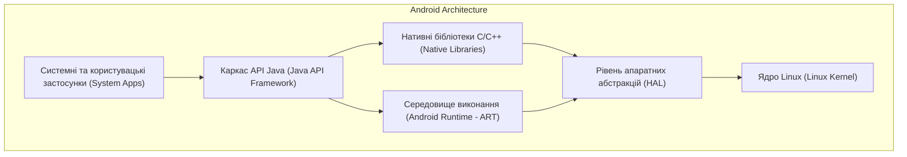
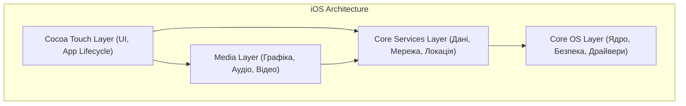

# Практична робота 1: Загальний огляд мобільних платформ

## Варіант 2: Архітектурне порівняння Android та iOS

---

## 1. Рівні архітектури Android та iOS (Зіставлення)

Android та iOS мають різну історію розвитку (Linux-базована відкрита система проти UNIX-базованої закритої екосистеми), проте їхні архітектурні шари концептуально виконують схожі завдання. Нижче наведено таблицю зіставлення рівнів обох операційних систем.

| Рівень абстракції | Android (рівень) | iOS (рівень) | Що містить / За що відповідає |
| :--- | :--- | :--- | :--- |
| **Рівень застосунків та UI** | System Apps & Java API Framework | Cocoa Touch | Компоненти інтерфейсу користувача, управління подіями екрана, доступ до системних додатків (камера, контакти), життєвий цикл застосунку. |
| **Медіа та графіка** | Native C/C++ Libraries & Android Runtime (ART) | Media Layer | Обробка аудіо, відео, 2D/3D графіки (OpenGL, Vulkan для Android / Metal, Core Audio для iOS), анімації. |
| **Системні сервіси та дані** | Java API Framework (Services) | Core Services | Робота з мережею, базами даних (SQLite / Core Data), геолокацією, файловою системою, фоновими процесами. |
| **Низькорівневе ядро** | HAL (Hardware Abstraction Layer) & Linux Kernel | Core OS | Взаємодія з апаратним забезпеченням (Bluetooth, Wi-Fi, сенсори), управління пам'яттю, безпека, драйвери, управління потоками. |

---

## 2. Архітектурні діаграми платформ

Нижче наведено дві діаграми, які ілюструють ієрархію рівнів обох мобільних операційних систем.

### 2.1 Архітектура Android

### 2.2 Архітектура iOS

---
